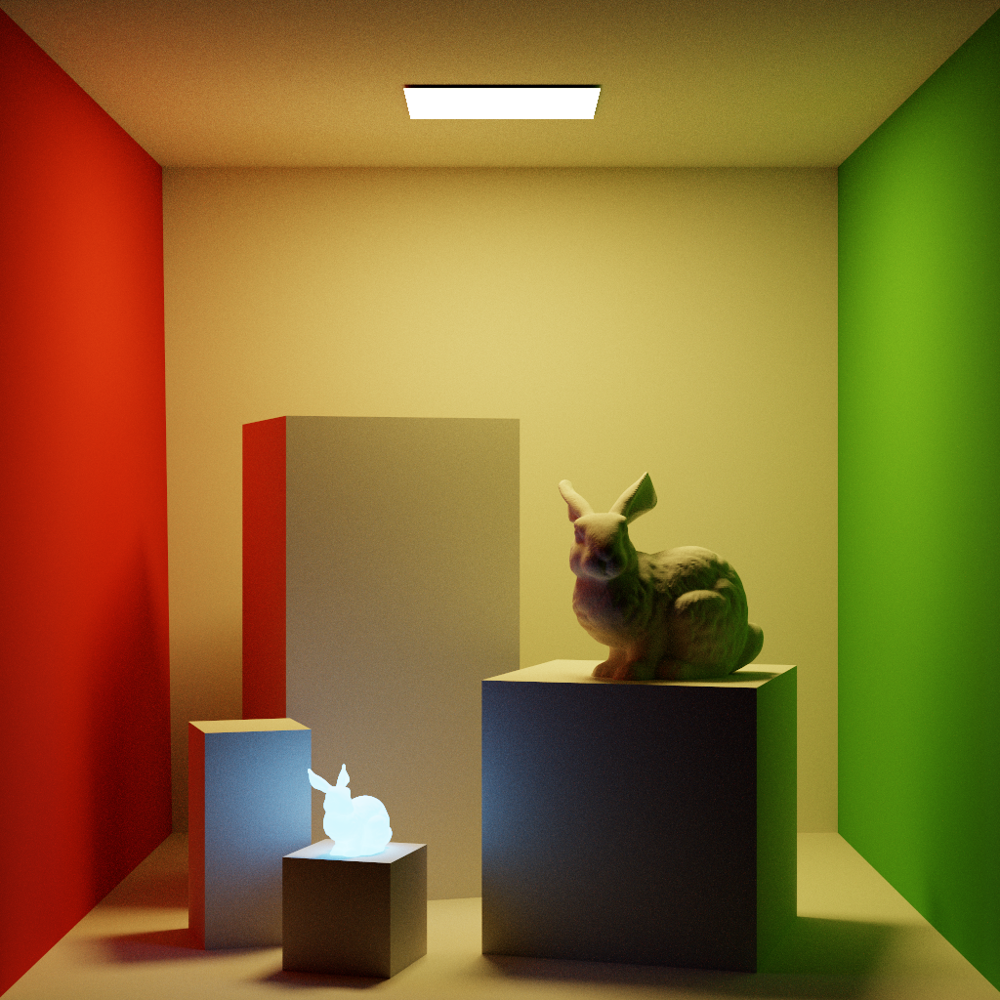

# LuisaRender
High-Performance renderer for stream architectures based on [LuisaCompute](https://github.com/Mike-Leo-Smith/LuisaCompute).

# Demo
Cornell Box with Bunnies.
- Multiple-Level Instancing
- Resolution: 1024x1024
- Max Depth: 10
- Integrator: Mega-Kernel Path Tracing

