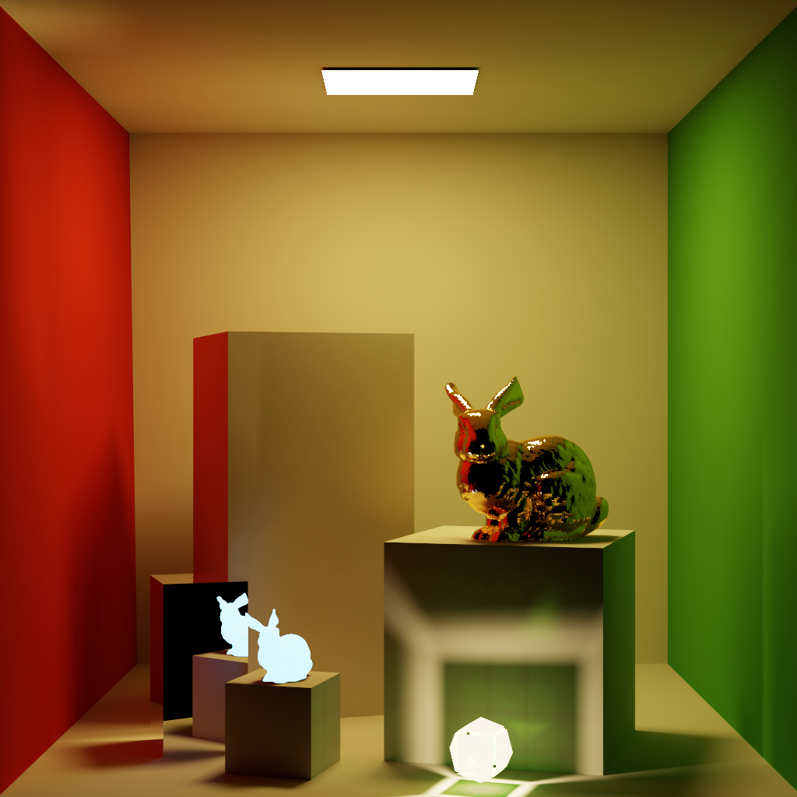

# LuisaRender
High-Performance renderer for stream architectures based on [LuisaCompute](https://github.com/Mike-Leo-Smith/LuisaCompute).

# Demo
Cornell Box with Bunnies.
- Multiple-Level Instancing
- Mega-Kernel Path Tracing
- Lambert & (Fake) Mirror Materials
- Diffuse Area Lights
- Samples per Pixel: 1,048,576
- Resolution: 1024x1024
- Max Depth: 10

