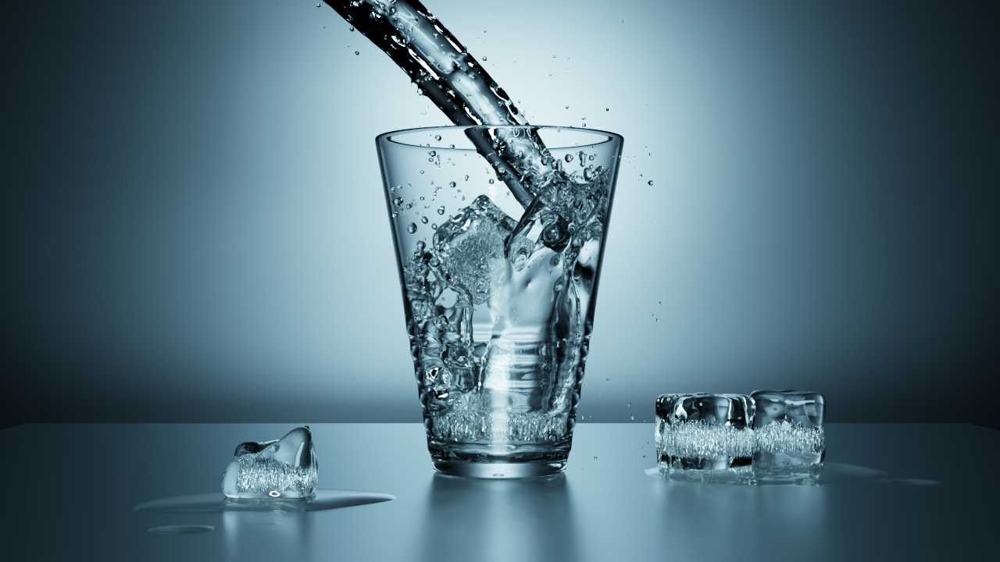
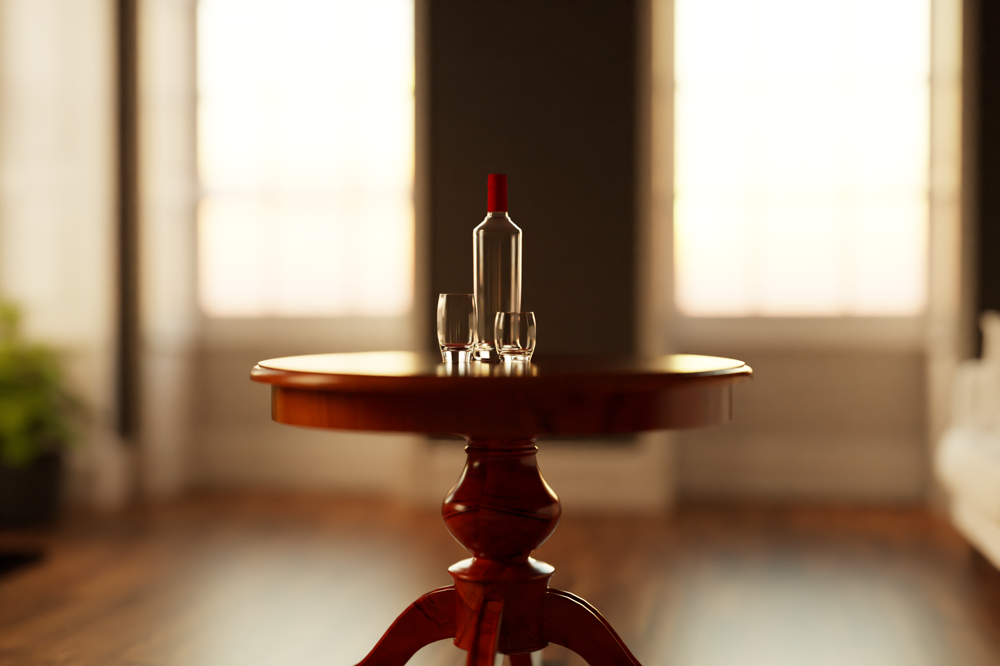
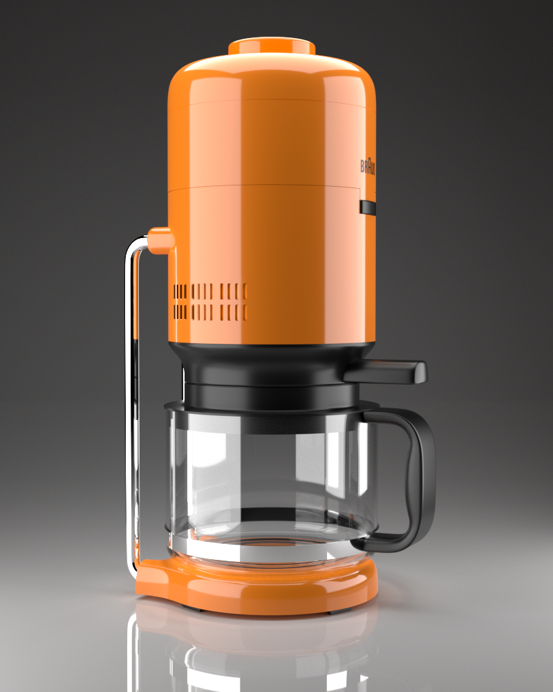
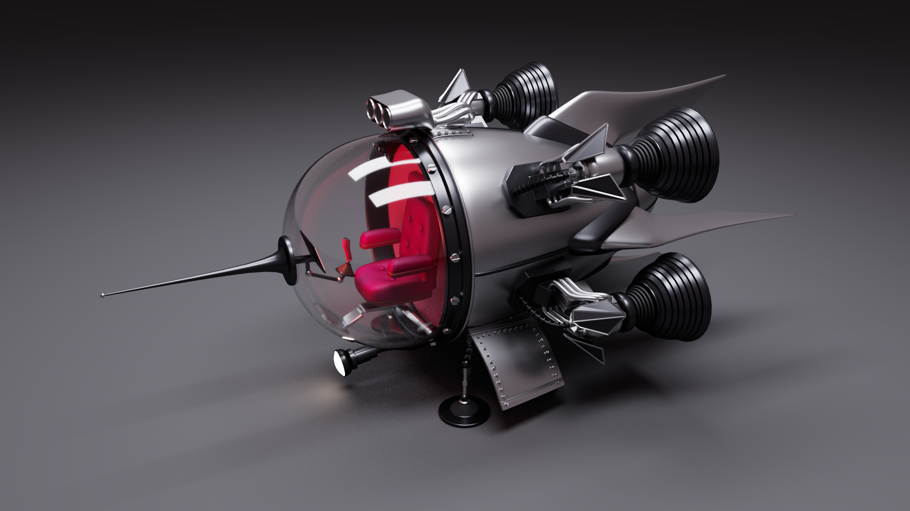
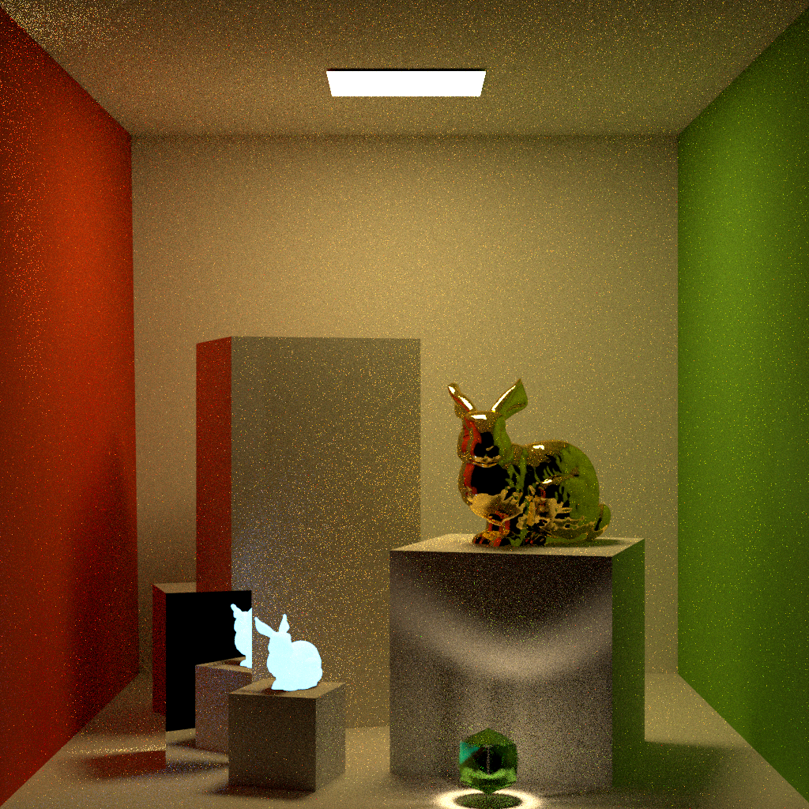
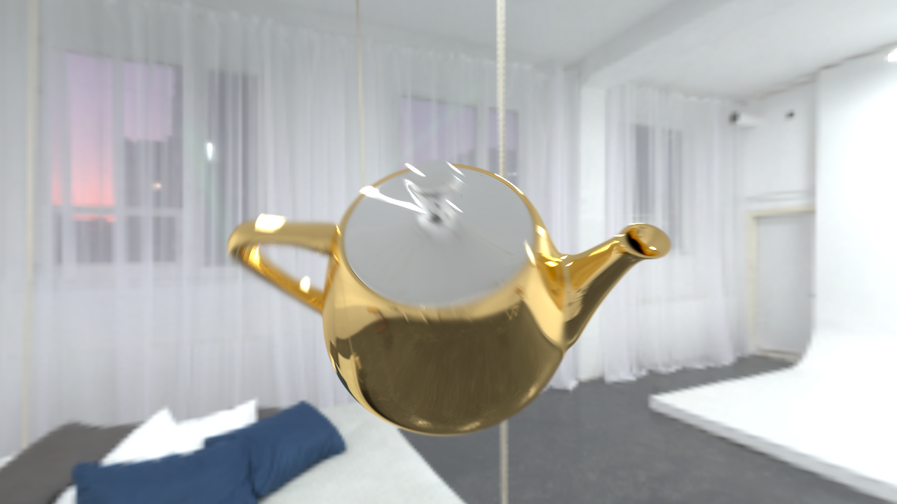
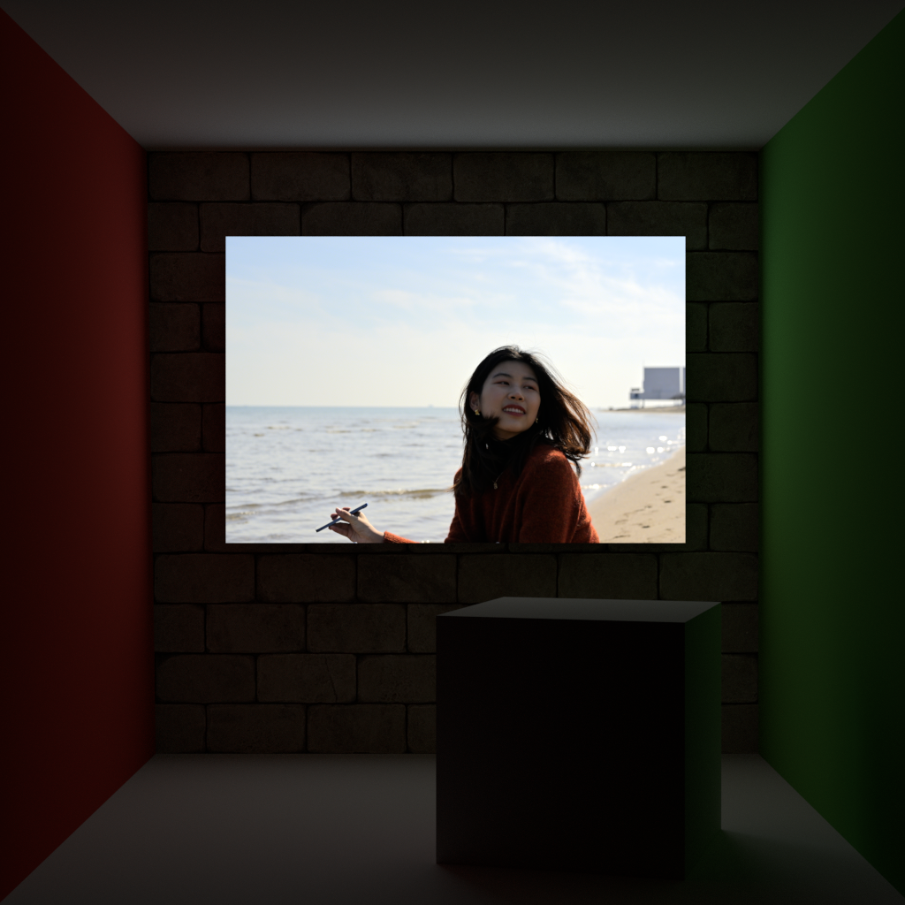
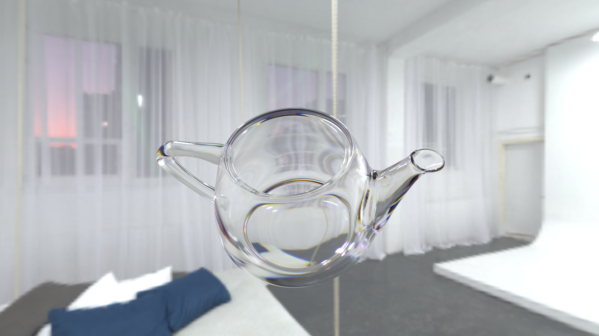

# LuisaRender

High-Performance renderer for stream architectures based
on [LuisaCompute](https://github.com/Mike-Leo-Smith/LuisaCompute).

# Demo

- Camera (Model and Environment Map from [PolyHeaven](https://polyhaven.com))
    - Wave-Front Path Tracing
    - Disney and Glass Materials
    - Environment Mapping
    - Resolution: 3840x2160
    - Max Depth: 10

- Glass of Water (from [Rendering Resources](https://benedikt-bitterli.me/resources/))
    - Wavefront Path Tracing
    - Glass, Substrate, and Metal Materials
    - Diffuse Area Lights
    - Resolution: 1280x720
    - Max Depth: 32

- Living-Room Table (from [Rendering Resources](https://benedikt-bitterli.me/resources/))
    - Mega-Kernel Path Tracing
    - Glass, Plastic, and Metal Materials
    - Environment Mapping
    - Spectral Rendering
    - Depth of Filed
    - Resolution: 1024x1024
    - Max Depth: 10

- Coffee (from [Rendering Resources](https://benedikt-bitterli.me/resources/))
  - Mega-Kernel Path Tracing
  - Diffuse Area Lights
  - Plastic, Disney, Glass, and Mirror Materials
  - Spectral Rendering
  - Resolution: 800x1000
  - Max Depth: 10

- Spaceship (from [Rendering Resources](https://benedikt-bitterli.me/resources/))
  - Mega-Kernel Path Tracing
  - Diffuse Area Lights
  - Substrate, Metal, Matte, and Glass Materials
  - Spectral Rendering
  - Resolution: 1280x720
  - Max Depth: 10

- Cornell Box with Bunnies
    - Mega-Kernel Path Tracing
    - Multiple-Level Instancing
    - Lambert & (Fake) Mirror Materials
    - Diffuse Area Lights
    - Spectral Rendering
    - Resolution: 1024x1024
    - Max Depth: 10

- Rotating Teapot with Environment Mapping
    - Mega-Kernel Path Tracing
    - Motion Blur
    - (Fake) Mirror Materials
    - HDRI Environment Mapping
    - Spectral Rendering
    - Resolution: 1024x1024
    - Max Depth: 10

- Cornell Box with Textured Area Light
    - Mega-Kernel Path Tracing
    - Textured Diffuse Area Light
    - Lambert Materials
    - Spectral Rendering
    - Resolution: 1024x1024
    - Max Depth: 10

- Glass Teapot
    - Mega-Kernel Path Tracing
    - Environment Mapping
    - Roughness Glass Material
    - Spectral Rendering
    - Resolution: 1024x1024
    - Max Depth: 16

- Plastic Teapot
    - Mega-Kernel Path Tracing
    - Environment Mapping
    - Roughness Plastic Material
    - Spectral Rendering
    - Resolution: 1024x1024
    - Max Depth: 16

