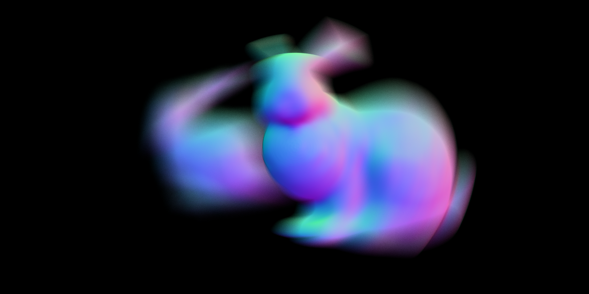

# LuisaRender
High-Performance Renderer on GPU.

## Features

### Architecture
| Feature                                                  | Progress  |
|----------------------------------------------------------|-----------|
| Plugin System                                            | Completed |
| Embedded DSL for Runtime Kernel Generation & Compilation | Completed |
| Scene Description Language                               | Completed |
| Wavefront Path Tracing                                   | Planned   |

### Backends
| Feature                    | Progress    |
|----------------------------|-------------|
| Apple Metal                | Refactoring |
| NVIDIA OptiX & OptiX-Prime | Planned     |
| Intel Embree               |             |
| ...                        |             |

### Cameras
| Feature                                   | Progress    |
|-------------------------------------------|-------------|
| Pinhole Cameras                           | Refactoring |
| Thin-Lens Cameras                         | Refactoring |
| Realistic Cameras                         |             |
| Fish-Eye Cameras                          |             |
| ...                                       |             |
| Camera Transform, Animation & Motion-Blur | Refactoring |
| Shutter Curves                            |             |

### Geometry
| Feature                                     | Progress    |
|---------------------------------------------|-------------|
| Triangle Meshes                             | Refactoring |
| Catmull-Clark Subdivision (with ASSIMP)     | Refactoring |
| Instancing                                  | Refactoring |
| Static and Dynamic Transforms & Motion-Blur | Refactoring |
| Curves                                      |             |
| Out-of-Core Ray Tracing                     |             |

### Illumination
| Feature                                       | Progress    |
|-----------------------------------------------|-------------|
| Point Lights                                  | Refactoring |
| Diffuse Area Lights                           | Refactoring |
| Realistic Lights                              |             |
| HDRI Environment Maps                         |             |
| Procedural Skylights                          |             |
| ...                                           |             |
| Uniform-Distribution Light Selection Strategy | Refactoring |
| Power-Distribution Light Selection Strategy   |             |

### Appearance
| Feature                      | Progress |
|------------------------------|----------|
| BSDFs                        | Planned  |
| Materials                    | Planned  |
| Spectral Rendering           |          |
| Textures & Filters           |          |
| Shading Language Integration |          |
| Texture Caches & Streaming   |          |

### Samplers
| Feature             | Progress    |
|---------------------|-------------|
| Independent Sampler | Refactoring |
| Halton Sampler      | Planned     |
| ...                 |             |

### Reconstruction Filters
| Feature                      | Progress    |
|------------------------------|-------------|
| Filter Importance Sampling   | Refactoring |
| Mitchell-Netravali Filter    | Refactoring |
| Box Filter                   | Refactoring |
| Triangle Filter              | Refactoring |
| Gaussian Filter              | Refactoring |
| Lanczos Windowed Sinc Filter | Refactoring |

### Integrators
| Feature           | Progress    |
|-------------------|-------------|
| Normal Visualizer | Refactoring |
| Path Tracing      | Planned     |
| SPPM              |             |
| PSSMLT            |             |
| ...               |             |
| AOV Support       | Planned     |

### Postprocessing
| Feature                              | Progress |
|--------------------------------------|----------|
| Colorspace Management & Tone Mapping |          |
| Postprocessing Effects               |          |
| Denoising                            |          |

### Renders
| Feature               | Progress    |
|-----------------------|-------------|
| Single-Shot Rendering | Refactoring |
| Animation Rendering   |             |
| Interactive Rendering |             |
| Remote Rendering      |             |

## Gallery

- Normal Visualizer + Subdivision + Instancing + Dynamic Transforms + Thin-Lens Camera + Motion-Blur (7.0s @ 1024spp)

