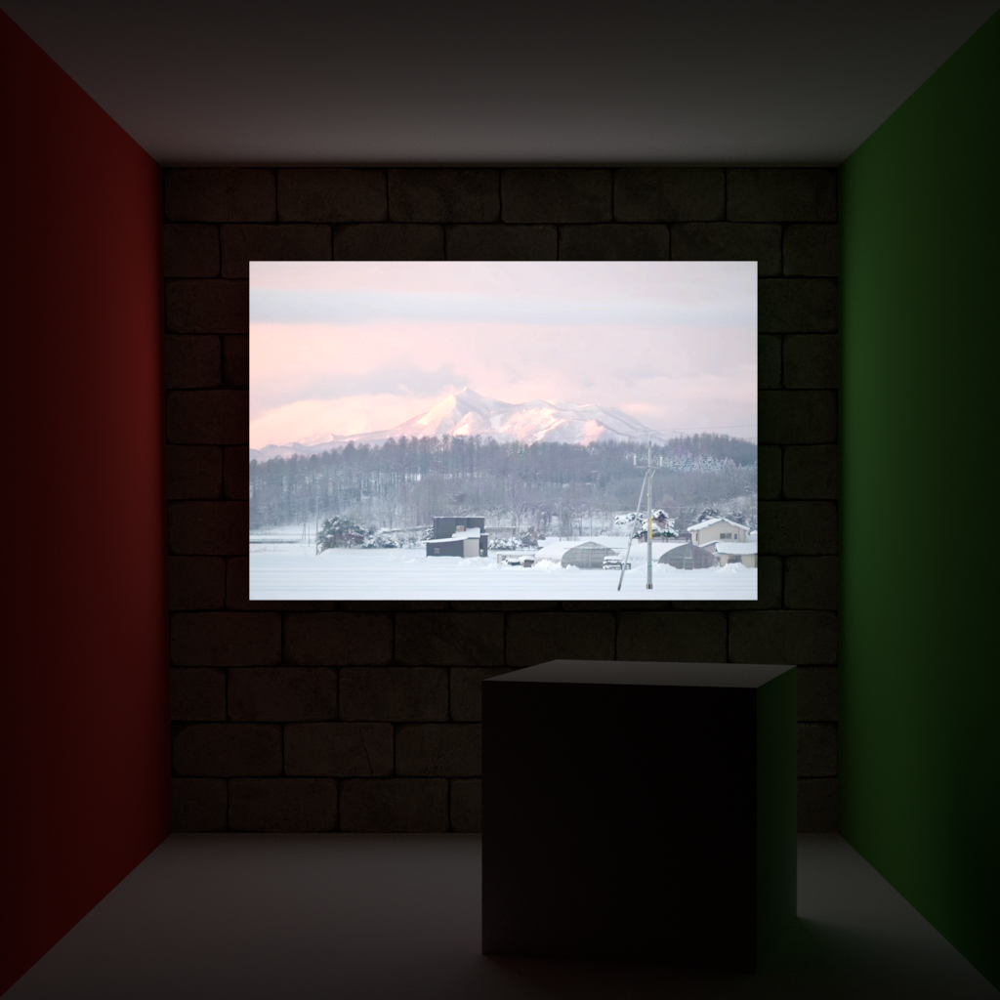

# LuisaRender

High-Performance renderer for stream architectures based
on [LuisaCompute](https://github.com/Mike-Leo-Smith/LuisaCompute).

# Demo

- Cornell Box with Bunnies.
    - Mega-Kernel Path Tracing
    - Multiple-Level Instancing
    - Lambert & (Fake) Mirror Materials
    - Diffuse Area Lights
    - Spectral Rendering
    - Resolution: 1024x1024
    - Max Depth: 10

- Rotating Teapot with Environment Mapping.
    - Mega-Kernel Path Tracing
    - Motion Blur
    - (Fake) Mirror Materials
    - HDRI Environment Mapping
    - Spectral Rendering
    - Resolution: 1024x1024
    - Max Depth: 10

- Luisa Illuminating the Render.
    - Mega-Kernel Path Tracing
    - Textured Diffuse Area Light
    - Lambert Materials
    - Spectral Rendering
    - Resolution: 1024x1024
    - Max Depth: 10

- Glass Teapot
    - Mega-Kernel Path Tracing
    - Environment Mapping
    - Roughness Glass Material
    - Spectral Rendering
    - Resolution: 1024x1024
    - Max Depth: 16
